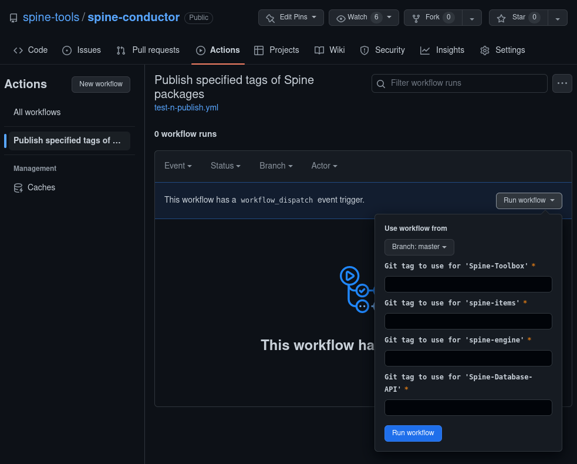

# About `spine-conductor`

It is a collection of release orchestration & automation scripts, and
CI workflows to simplify Spine tool development tasks.

# Installation & dependencies
You can install the tools in this repo as usual using `pip`.  If you
don't intend to develop the tool, you can use `pipx`, otherwise the
manual installation might be prefered.

## Using `pipx`
- Installation:
  ```shell
  pipx install git+https://github.com/spine-tools/spine-conductor.git
  ```
- Upgrade:
  ```shell
  pipx upgrade spine-conductor
  ```

## Manual installation
Manual: `git clone <repo>` followed by `pip install`

```shell
git clone git@github.com:spine-tools/spine-conductor.git
# or: gh repo clone spine-tools/spine-conductor
cd spine-conductor
python -m venv --prompt conductor .venv
source venv/bin/activate # on Linux/MacOS, see below for Windows
pip install -U pip
pip install -e .
```

Alternatively, you could also try installing it with pipx from the
local repo.

### Additional note for Windows
To activate the virtual environment on Windows, depending on the
command line shell you are using, you can use either of these:

```shell
$ source venv/Scripts/activate # on git-bash
$ .\venv\Scripts\activate.ps1 # on powershell
```

### Updating
Go to the repo on the terminal, then:

```shell
git switch master
git pull
source venv/bin/activate
pip install -e .
```

## Dependencies
- The `conduct release` command uses Git behind the scenes.  So will
  need to have the `git` available in the same shell.
- To use the `conduct publish` command, you besides Git, you also need
  [`GitHub CLI`](https://github.com/cli/cli) (`gh`) installed and configured.
  Please see the upstream docs for details.
- If you do not want to use `gh`, you will have to push the tags to
  GitHub manually, and trigger the publish workflow from GitHub (see
  below).

# Usage
## Create the release tags
```shell
$ cd /path/to/repo/Spine-Toolbox
$ conduct release --bump patch -c release.toml  # or include in pyproject.toml
Repository: /path/to/repo/Spine-Toolbox
## master...origin/master
 M pyproject.toml (1)
Select the files to add (comma/space separated list): 1
Creating tag: 0.6.19 @ 034fb4b
Repository: /path/to/repo/spine-items
## master...origin/master
 M pyproject.toml (1)
Select the files to add (comma/space separated list): 1
Creating tag: 0.20.1 @ 5848e25
Repository: /path/to/repo/spine-engine
## master...origin/master
 M pyproject.toml (1)
Select the files to add (comma/space separated list): 1
Creating tag: 0.22.1 @ e312db2
Repository: /path/to/repo/Spine-Database-API
## master...origin/master
Select the files to add (comma/space separated list):
Creating tag: 0.29.1 @ d9ed86e

Package Tags summary  💾 ➡ 'pkgtags.json':
{
  "Spine-Toolbox": "0.6.19",
  "spine-items": "0.20.1",
  "spine-engine": "0.22.1",
  "Spine-Database-API": "0.29.1"
}
```

## Release the packages to PyPI
```shell
$ conduct publish --pkgtags pkgtags.json -c release.toml
```

Alternatively, you could do this step manually as follows:

1. push the tags to GitHub
   ```shell
   for repo in . /path/to/repo/{Spine-Database-API,spine-{items,engine}}; do
       pushd $repo;
       git push origin master --tags;
       popd
   done
   ```
   Or with Powershell on Windows:
   ```shell
   "." , "/path/to/repo/spinedb-api", "/path/to/repo/spine-items", "/path/to/repo/spine-engine" | % {
     pushd $_;
     git push origin master --tags;
     popd;
   }
   ```

2. trigger the workflow
   ```shell
   $ cat pkgtags.json | gh workflow run --repo spine-tools/spine-conductor test-n-publish.yml --json
   ```

   You can also trigger the workflow from GitHub.  You will have to
   add the tags manually in that case.

# Configuration

The release tagging script is configured in TOML format as shown below:
```toml
[tool.conductor]
packagename_regex = "spine(toolbox|(db){0,1}[_-][a-z]+)"  # package name on PyPI

[tool.conductor.dependency_graph]
spinetoolbox = ["spine_items", "spine_engine", "spinedb_api"]
spine_items  = ["spinetoolbox", "spine_engine", "spinedb_api"]
spine_engine = ["spinedb_api"]
spinedb_api  = []

[tool.conductor.repos]
spinetoolbox = "."
spine_items  = "venv/src/spine-items"
spine_engine = "venv/src/spine-engine"
spinedb_api  = "venv/src/spinedb-api"

# # default
# [tool.conductor.branches]
# spinetoolbox = "master"
# spine_items  = "master"
# spine_engine = "master"
# spinedb_api  = "master"
```

It can be included in `pyproject.toml`, or kept in a separate config
file.  In the latter case, it needs to be provided with the
`-c`/`--config` option when calling the release tagging script.

## Publishing to PyPI

We use the [Trusted
Publishers](https://docs.pypi.org/trusted-publishers/) feature for
releasing to PyPI.  First we have to add this repo as the source for
releases.  Following which, we can trigger the workflow manually or
using [GitHub CLI](https://cli.github.com/).

The release tagging script writes a file called `pkgtags.json` in the
current directory.  It lists the repos that were tagged, along with
the tags.  This can be fed to GitHub CLI to initiate publishing.
```shell
$ cat pkgtags.json | gh workflow run --repo spine-tools/spine-conductor test-n-publish.yml --json
```

The packages may also be publised by triggering the workflow manually
from GitHub.  In that case, the release tags for the different Spine
repos have to be entered manually.


