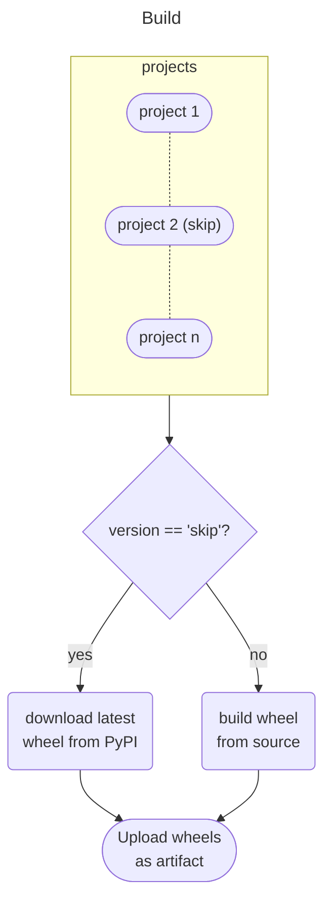
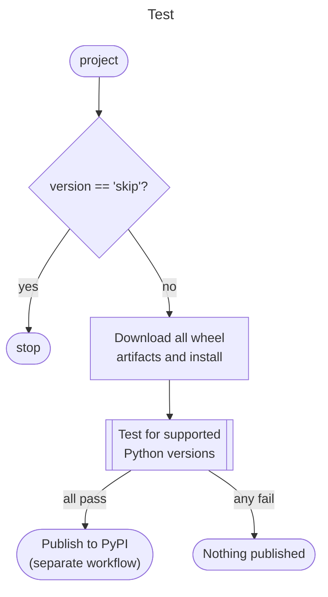

# Rationale & Design
The current release process has manual steps.  Mostly
- to manage the version information, and
- to ensure the consistency of the dependency requirements with other Spine packages

Address the above with the following workflow:
1. use [`setuptools_scm`](https://github.com/pypa/setuptools_scm/) to
   manage versions dynamically using git tags
2. use a release tagging script to generate the next version number,
   update the dependency requirements, and create the git tag
3. push the tags to github, and publish the packages to pypi using
   github actions

For the tagging script to work, the build system of all the projects
should be similar.  Since it requires automatic updates, I chose
`pyproject.toml` as the library to r/w toml is quite mature, and both
`setup.py` and `setup.cfg` are now deprecated.  The current spine
packages mostly use `setup.cfg` except Spine Engine.  But even in that
case, the `setup.py` is simple, so migration is straightforward.

# Toy example
The above scheme is implemented in a set of 3 toy repos, where 2 of
them have circular dependency:
- [scm](https://github.com/suvayu/scm) hosts the package `sa-foo`
- [scm-dep](https://github.com/suvayu/scm-dep) hosts the package `sa-bar`
- [scm-base](https://github.com/suvayu/scm-base) hosts the package `sa-baz`
- `sa-foo` and `sa-bar` have a cyclic dependency

Release is done by running [`conduct release`](./orchestra/release.py).
The primary repo (`scm`) has an action to build and publish
wheels and tarballs to TestPyPI.  At the moment they are platform
independent wheels, but when the need arises switching to platform
dependent wheels should be possible (e.g. by using [`cibuildwheel`](https://cibuildwheel.readthedocs.io/en/stable/)).

# Supporting developer build
We can use [`requirements.txt`](./requirements.txt) to setup the dev
environment.  If people like to choose the location of the checked out
repo for all packages, they may modify the URLs.  This is necessary
because editable install for dependencies is not yet supported using
`pyproject.toml`; i.e. the case when `sa-foo` (the primary package)
depends on `sa-bar`, and you want to have editable install for both.
To cover this case, we choose requirements file to setup the dev
environment.

*Note:* The requirements file need not list other dependencies as
pyproject.toml includes them.  So this is sufficient:
```
-e ../scm-dep
-e ../scm-base
-e .
```

## Version options for dev build
The version information is derived from the repo history, the choice
are the following (latest existing tag is **0.3.1**):
```python
>>> from setuptools_scm import get_version
>>> get_version(version_scheme="python-simplified-semver")
'0.3.2.dev1+gbfb07af'
>>> get_version(version_scheme="release-branch-semver")
'0.4.0.dev1+gbfb07af'
>>> get_version(version_scheme="guess-next-dev")
'0.3.2.dev1+gbfb07af'
>>> get_version(version_scheme="no-guess-dev")
'0.3.1.post1.dev1+gbfb07af'
>>> get_version(version_scheme="post-release")
'0.3.1.post1+gbfb07af'
```

Preference:
- `release-branch-semver`: forward-looking (current choice)
- `post-release`: clear and concise

# Release workflow




